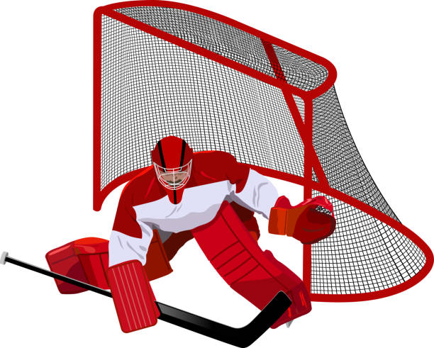

# NHLGoalCoords

  

_Have you ever wondered how your favorite NHL teams' goalie is performing?_

 

_How about where your teams' defensive holes are located?_

 

The goal of this project is to determine if there is a weaker side of the goal or defense, do opponents target this side, and should the opponents target a particular side. 

# Background

I am a life long [St. Louis Blues](https://www.nhl.com/blues) fan, and we have definitely had some up and down years. I wanted to determine where my teams' defensive holes were, particularly in net. The NHL provides all live game data through their new API available free to the public, found at https://statsapi.web.nhl.com/api/v1 (using the appropriate endpoints). While this tutorial will focus on the St. Louis Blues starting goalie (Jordan Binnington), all goalies are available through this application.

# NHL Arena

A hockey arena is 200 feet long x 85 feet wide, with rounded corners. This means that each half is 100 feet long x 42.5 feet wide. The goal sits 11 feet from the edge (89 feet from center), and location 0 (center ice). The coordinate system indicates that the right half of the arena is noted by positive x-coordinates, and the left half is located with negative x-coordinates. Similarly, the y-coordinates are positive when above center ice, while negative y-coordinates are below center ice.

  

# Strong vs Weak Side

The strong side for a goalie is considered the glove (catching) hand. That means that the weak side for a goalie is the stick side. The goalie has faster movement on the glove hand, because there is not nearly as much weight on the arm. 

# Application

When the application is opened, the left side of the screen contains the entire table of available goalies. Above the table is a search box that makes it a bit easier to find the player that one is looking for. The entries in the table contain the NHL Player ID, first and last name, and what side the player catches. Generally, a player that catches left is right handed, and a player that catches right is left handed. 

 

In the case of this study, "binn" was searched and "Jodan Binnington" is found. Binnington catches left, so it is assumed that his strong side is his left and his weak side is his right. Let's dive into that a bit. If the goalie has a strong side of their left, that means that a shot from coordinates (-x, +y) or (+x, -y) should be coming from their strong side. This can also mean that the nearest post to the goalie should be their strong side. _Why is this important to mention?_ It should be easier for a goalie to stop a shot from their strong side. 

 

Now that a player has been selected, the right side of the screen will begin to populate. The drop down menu on the top of the right side will be filled with the seasons that the goalie played or was rostered. When a season is selected, the table will display all shots from that year where the goalie was defending. The graph will also display all of the shots on the coordinate system. When looking at the (x, y) coordinates on the graph, visualize the goals on the left and right side of the graph located roughly at (-89, 0) and (89, 0). 

 

The bottom table on the right side of the screen provides the seasonal outlook for the goalie. The table provides the shots, goals, and save percentage for both the glove and stick side of the goalie. The side with the lower save percentage is highlighted in yellow. It is considered irregular for the weaker side to be the glove side. In the image below, Binnington had a year where his stronger side was his stick side. 

 

  

# Outcome

The image above displays a different result, but Binnington typically follows suit and his strong side is his glove hand. In the 2021-2022 season that did not follow, and his save percentage was down nearly three percent on his glove side. This is actually alarming given the number of shots taken is nearly equal, but the goals allowed is 13 higher. _Why did this happen?_ It could have been an off year for Binnington, or it could have been a weakness in the defense. 

 

Let's have a look at the questions/goals for this application.

 

Q: _Is there is a weaker side of the goal or defense?_
 
A: _In the 2021-2022 season there was definitely a weaker side being the left side of the ice (glove side for Binnington)_

 

Q: _Do opponents target this side?_
 
A: _No, the number of shots taken is nearly identical to the other side._

 

Q: _Should the opponents target this weaker side._
 
A: _In this particular year, I would say yes. However, analyzing his other years in net the numbers show that his glove side is his stronger side. If teams were going to take advantage of this anomoly it would have had to been during that season, as the results indicate that it would not have made a difference at any other point._

# Future Considerations

- Remove shots and goals where the shot occurred within a certain distance of goal. _Why?_ These events could be assumed to close and skew the data. There are a lot of goals picked up off of rebounds or scuffles in front of the net. 

# Retrieving The Data

_Note: Before starting this process, remove `ReadFiles.json` in `./hack` to ensure that all data is pulled._

- Pull the latest from [nhl](https://github.com/barbacbd/nhl).
- Locally install the nhl library.
- Move to the [hack](./hack/) directory of this project. 
- Execute the [NHLAPIPuller](./hack/NHLAPIPuller.py) script to pull all of the data. This will create a directory called `nhl_data` that contains all of the years selected by the user (default is all). _Note: This will take a while to grab all of the data._
- Execute the [NhlDB](./hack/NhlDB.py) script to convert the data from the previous step into a sqlite database. _Note: This is not saved in this project because of the file size._
- There are corrections required to some of the player info, execute the [Corrections](./hack/Corrections.py) script. _Note: Technically this should not change any players that contain data with coordinates attached.

# Disclaimers

_The application can only be used for goalies that have played in more recent years. The NHL recently began tracking Coordinates for all events._

_"Missed shots" from the NHL live game data are Not calculated into the percentage. If the goalie did NOT have to act, then it is not counted._

_The data loaded for this study only contains live game data for Regular season games._

# Copyright

_NHL and the NHL Shield are registered trademarks of the National Hockey League. NHL and NHL team marks are the property of the NHL and its teams. NHL 2023. All Rights Reserved._

